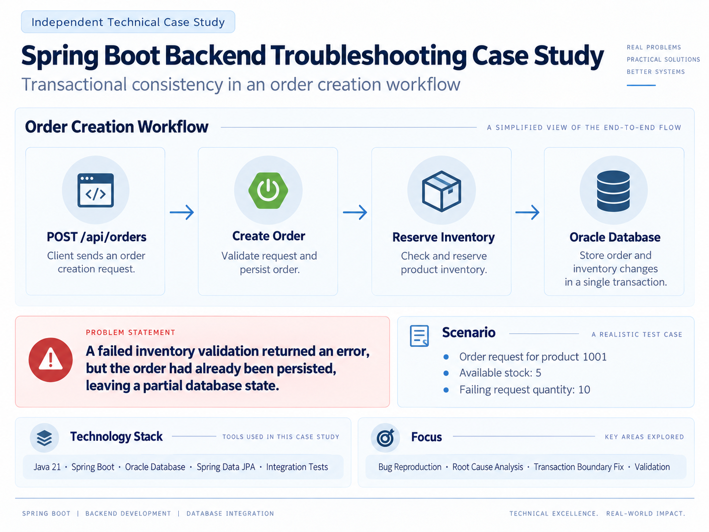
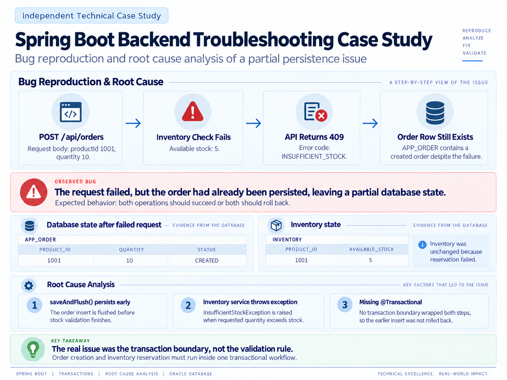
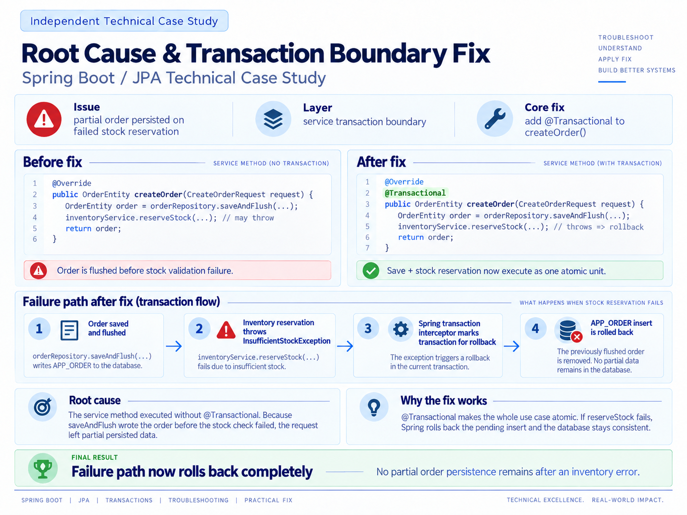
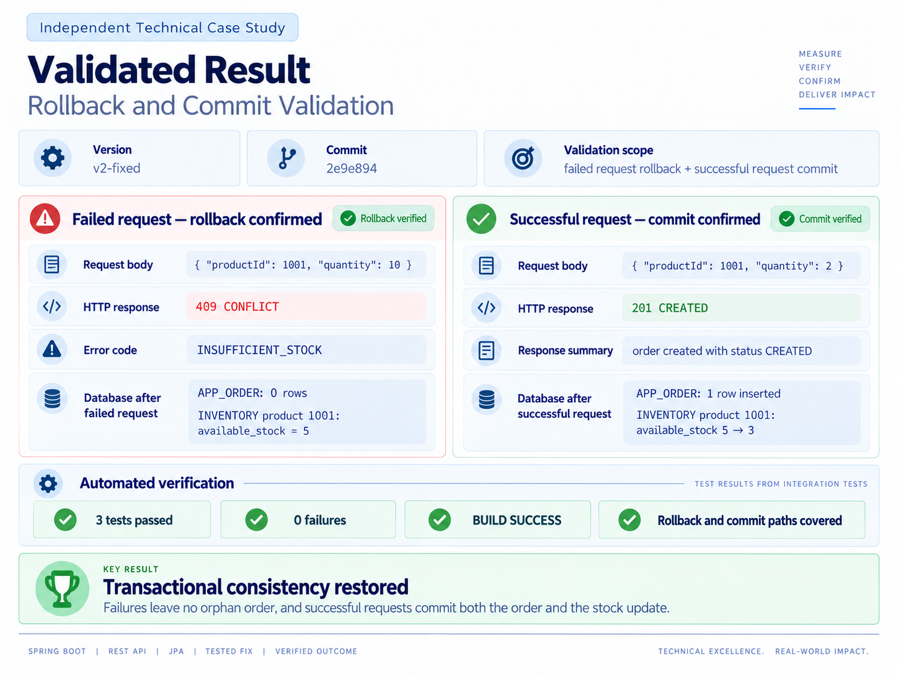

# Spring Boot Backend Troubleshooting — Transactional Consistency Failure

Technical case study demonstrating how a missing transaction boundary in a Spring Boot application can leave partially persisted data after a business operation fails.



## Problem

The application creates an order and then reserves inventory.

Expected behavior:

```text
Create order
    ↓
Reserve inventory
    ↓
Success → commit both operations
Failure → rollback both operations
```

Initial inventory:

```text
Product ID: 1001
Available stock: 5
```

A request for 10 units correctly returned:

```text
HTTP 409 Conflict
INSUFFICIENT_STOCK
```

However, the order was still persisted in Oracle:

```text
APP_ORDER
PRODUCT_ID   QUANTITY   STATUS
1001         10         CREATED

INVENTORY
PRODUCT_ID   AVAILABLE_STOCK
1001         5
```

The request failed, but the database was left in a partial state.



## Root Cause

`OrderServiceImpl.createOrder()` did not define a transaction boundary around the complete business operation.

The order was persisted before inventory reservation failed, and there was no enclosing transaction capable of rolling it back.

## Fix

The transaction boundary was added to the orchestration service:

```java
@Transactional
public OrderEntity createOrder(CreateOrderRequest request) {
    ...
}
```

This ensures the complete operation is atomic.



## Validation

### Insufficient stock

Request:

```json
{
  "productId": 1001,
  "quantity": 10
}
```

Result:

```text
HTTP 409 Conflict

APP_ORDER
<no rows>

INVENTORY
PRODUCT_ID   AVAILABLE_STOCK
1001         5
```

The complete operation is rolled back.

### Successful order

Request:

```json
{
  "productId": 1001,
  "quantity": 2
}
```

Result:

```text
HTTP 201 Created

APP_ORDER
PRODUCT_ID   QUANTITY   STATUS
1001         2          CREATED

INVENTORY
PRODUCT_ID   AVAILABLE_STOCK
1001         3
```

Both changes are committed successfully.



## Integration Tests

The corrected version includes integration tests against Oracle:

```text
shouldRollbackOrderWhenStockIsInsufficient()
shouldCommitOrderAndInventoryWhenStockIsAvailable()
```

Final Maven validation:

```text
Tests run: 3, Failures: 0, Errors: 0, Skipped: 0
BUILD SUCCESS
```

## Versioned Reproduction

The repository preserves both versions of the case.

Bug reproduction:

```text
Branch: bug-reproduction
Tag:    v1-bug-reproduction
Commit: 5802d96
```

Corrected version:

```text
Branch: master
Tag:    v2-fixed
Commit: 2e9e894
```

## Technical Evidence

```text
evidence/raw/
├── 01_bug_reproduction.txt
├── 02_transaction_boundary_fix.diff
├── 03_fixed_rollback.txt
├── 04_maven_tests.txt
└── 05_successful_commit.txt
```

## Technology Stack

- Java 21
- Spring Boot 4.1.1
- Spring Data JPA
- Hibernate
- Oracle Database
- Maven
- JUnit
- Docker

## Key Takeaway

The visible symptom was a failed inventory reservation.

The root cause was the scope of the transaction.

Moving the transaction boundary to the service orchestrating the complete business operation restored atomic behavior:

```text
success → commit everything
failure → rollback everything
```
